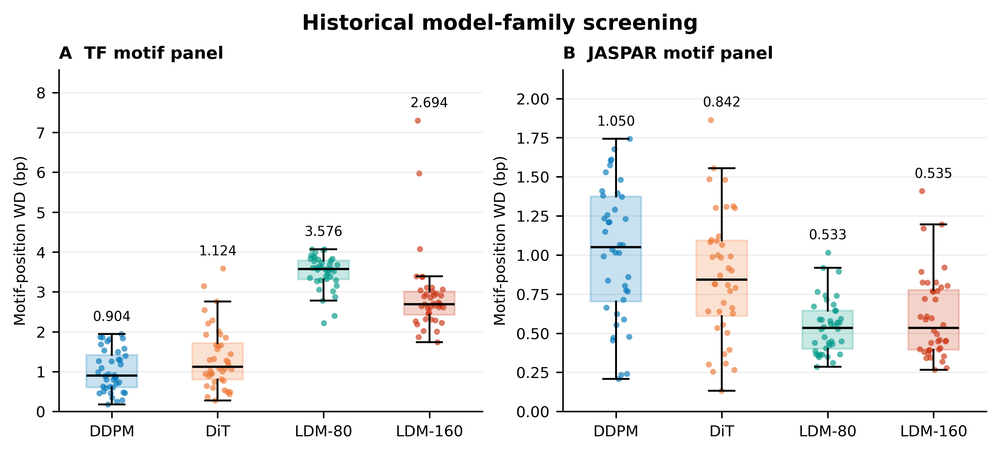
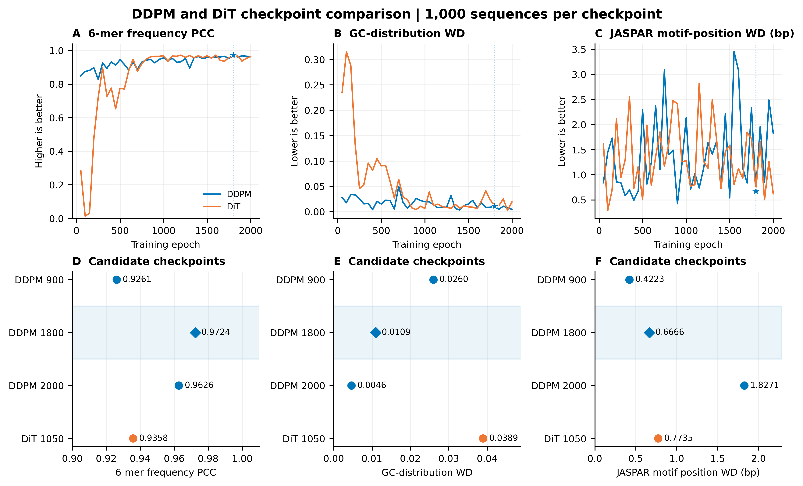

# 生成模型与checkpoint选择：审阅入口

本轮检查enhancer.pptx第8–15页，重新分析旧版final DDPM与DiT的80份FASTA（80,000条160bp序列），并对历史候选的原始FIMO结果重计数。**现有证据支持DDPM epoch1800作为生成质量主候选，尤其支持其优于PPT中选择的DiT epoch1050；不支持“DDPM所有指标优于所有其他模型”。**

[Word审阅稿](model_selection_review_zh.docx)已嵌入两张图及中文核验结论。

## 结果图

### Figure S1：模型家族筛选



[SVG矢量图](../../figures/model_selection/figure_model_family_screening.svg)。每个点是一个历史checkpoint，箱体表示checkpoint间四分位范围，数字为中位数，不是独立重复实验的误差条。A为39个TF motif面板的位置WD；B为历史JASPAR面板的位置WD。DDPM的TF位置WD中位数0.9038低于DiT 1.1236、LDM-80 3.5758、LDM-160 2.6940；JASPAR下LDM的WD反而更低，因此不能只保留A来宣称DDPM全面最优。

这些320行历史CSV属于evaluate_effect的另一评价批次，checkpoint与当前固定权重关系尚未全部恢复。图件用于展示历史筛选线索，不与下图FASTA指标拼成统一总分。未对这320项逐一重计数FIMO。

### Figure S2：DDPM与DiT的具体checkpoint比较



[SVG矢量图](../../figures/model_selection/figure_checkpoint_selection.svg)。每种模型40个checkpoint，每个现存FASTA都是1000条合法160bp序列。A/B分别从原始序列重算6-mer频率PCC和GC分布WD；C为历史JASPAR2022 motif中心位置WD。D–F展示历史候选DDPM1800、DiT1050，以及DDPM900（本轮DDPM位置WD最小）与DDPM2000（10/1引导补验使用）的权衡。蓝色菱形标出DDPM1800。PCC高为好，两个WD低为好；D为点图且明确显示截取的数值轴。

| 模型／checkpoint | 6-mer PCC ↑ | GC分布WD ↓ | JASPAR位置WD ↓ |
|---|---:|---:|---:|
| DDPM 900 | 0.9261 | 0.0260 | **0.4223** |
| **DDPM 1800** | **0.9724** | 0.0109 | 0.6666 |
| DDPM 2000 | 0.9626 | **0.0046** | 1.8271 |
| DiT 1050 | 0.9358 | 0.0389 | 0.7735 |

DDPM1800的6-mer PCC为80个DDPM/DiT现存批次中的最高值；在这三个指标上同时优于历史选定的DiT1050。它是三指标的Pareto非支配候选之一，但不是唯一候选；DiT其他checkpoint也在Pareto集合中。不增加主观加权总分或虚构显著性。

## 推荐权重及结果范围

**用于生成质量主结果的推荐：**

`topic_all/topic2_Diffusion/DDPM/final/DDPM/params/epoch_1800_params.pkl`

SHA256：`431b3c843a23a041225cd5be770550b7478494ab830d68f6f5162d683d36d1de`。

当前源码、生成日志及FIMO XML将该分支epoch1800关联到现存序列。权重哈希固定当前文件；原始采样缺少seed和不可变权重哈希，不宣称从头可精确复现。

10/1classifier-guidance补验用同分支的**epoch2000**（SHA256 `98dec05764d7f7978111e266fe9cded1f49b0c4204477501f320f30f558c9a1f`）。它的结果不能改标为1800。若论文要求无引导与引导全程同一权重，还缺epoch1800的对应引导对照，不能由本次质量比较替代。

当前推荐按“保留序列分布并支持后续计算研究”解释。对UViT-v2/v3没有与本轮同数据、同采样评价的完整对照，不能据此声称DDPM优于UViT；当前另一批次中UViT-v2 config4的WD更低这一事实仍应保留。

## PPT核验与更正

1. 第15页明确写“DiT选择1050epoch，DDPM选择1800epoch”，恢复了历史选择记录；这与先前Maize/UViT页不同。
2. 第14–15页曲线数值与旧版final DDPM/DiT的JASPAR表吻合，包括DDPM1800命中37327、WD0.6666及DiT1050命中39813、WD0.7735。
3. PPT第14页写“生成2000条”，但两份现存生成代码及本次原始FASTA、FIMO XML确认**每个checkpoint1000条**。新图使用实际数量，不继承错误表述。
4. motif命中总数必须考虑序列数量；真实参照11984条，生成1000条，直接比497706与37327不能解释为motif不足。本次若报告命中密度，需除以各自序列数：真实41.531、DDPM1800 37.327、DiT1050 39.813次/序列。
5. 第8–11页包含6-mer、GC及Inner/Outer曲线，比较维度可复用，但原始作图数值表和具体距离定义尚未完整恢复。本次新图重新读取FASTA，不从截图估读数字，也不将这些图原样视为逐点复验完成。
6. 第15页重复序列截图没有可追溯的文件名、checkpoint或样本总体。不能以这张截图认定DiT1050发生整体模式崩塌：现存1050的1000条序列全部唯一，只有1条出现至少20bp的周期2重复。截图可能来自其他批次，来源待确认。

## 评价限制

真实参照为当前NG CSV中11984条合法唯一序列，是训练数据来源，不是独立测试集。6-mer统计正向链重叠窗口、完整4096词表；GC WD按每序列GC比例的经验分布计算。历史JASPAR WD按位置计数且每位置加1伪计数；真实11984条与生成1000条的伪计数相对权重不同，保留旧实现用于追溯，不能宣称完全消除了样本量效应。

80个checkpoint不是80次独立训练；每个checkpoint只用一份历史采样。新结果是回顾性评价，未证明统计显著性、生物活性或泛化优势。主指标、最低质量门槛及最终单一权重仍须作者确定。本次未训练、重新采样、重新运行FIMO或写入服务器。

## 数据与复现

- [80个checkpoint的质量表](../../data/verified/legacy_full_checkpoint_quality.csv)
- [80份FASTA来源及哈希](../../data/verified/legacy_full_fasta_sources.csv)
- [历史四模型筛选表](../../data/verified/legacy_family_screening.csv)
- [候选序列指标](../../data/verified/legacy_selection_quality.csv)、[逐序列GC与重复指标](../../data/verified/legacy_selection_observations.csv)、[6-mer频率](../../data/verified/legacy_selection_sixmer.csv)
- [评价协议与FASTA哈希](../../data/verified/legacy_selection_quality_protocol.json)、[候选原始FIMO重计数及权重哈希](../../data/verified/legacy_selection_fimo_audit.json)
- [图件脚本](../../figures/plot_model_selection.py)，本地读取上述CSV，输出450 DPI PNG与SVG。

当前论文主文仍保留之前A/M历史分析；本包是待作者确认的旧版final主线选择证据，不自动把其他模型结果改名或合并。

## 私有导出输入与重算命令

来源导出JSON均为数组，每项包含source_relative_path、text、size、sha256。私有输入文件：sources_03.json（含NG CSV）、sources_ppt_legacy.json（历史代码和表）、sources_legacy_all_fasta.json（80份FASTA）、sources_selection_sequences.json（四份候选FASTA）；legacy_selection_fimo_metadata.jsonl为原始FIMO只读重计数结果，每行一个JSON。原始序列和PPT未上传。

```bash
python scripts/reanalyse_legacy_checkpoint_sweep.py --source-dir /path/to/private/exports
python scripts/reanalyse_legacy_candidates.py --source-dir /path/to/private/exports
python scripts/check_legacy_selection_fimo.py --source-dir /path/to/private/exports
python figures/plot_model_selection.py
```
