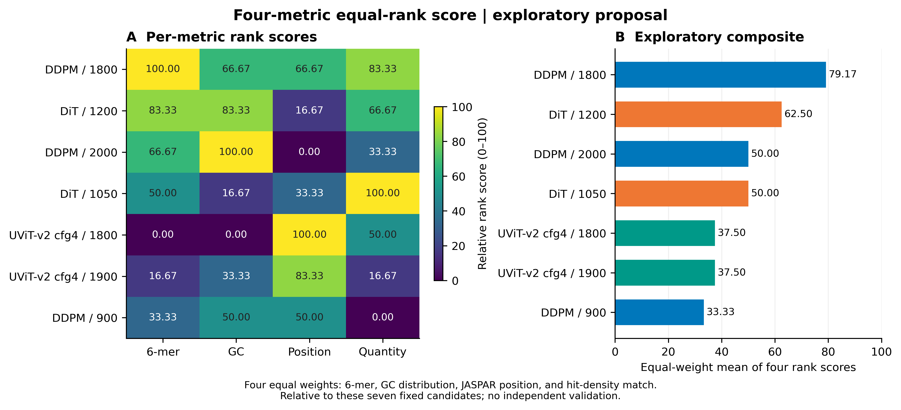
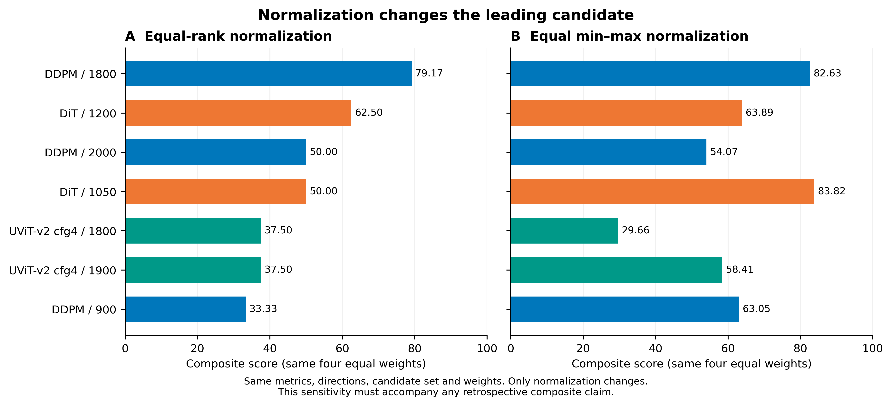

# 四项等权排名分：探索性综合评分方案

状态：**供作者讨论的回顾性方案，尚未冻结为论文主指标或最终权重选择规则。** 只使用现有JASPAR统一评价数据，TF不纳入。没有新增训练、生成或服务器任务。

[Word审阅稿](composite_score_review_zh.docx)同时包含评分图和归一化敏感性图。

## 建议公式

四项各占25%，可以理解为“序列组成50%＋JASPAR motif50%”：

| 指标 | 方向 | 权重 |
|---|---|---:|
| 6-mer频率PCC | 越高越好 | 25% |
| GC分布WD | 越低越好 | 25% |
| JASPAR motif位置WD | 越低越好 | 25% |
| 命中密度与真实参照的绝对差 | 越低越好，不最大化数量 | 25% |

当前共N=7个固定候选。每项分别排序，第一名为rank1，同值并列取平均名次。单项分数及综合分为：

$$s_j=100\frac{N-r_j}{N-1},\qquad S=\frac{s_{6mer}+s_{GC}+s_{position}+s_{quantity}}{4}.$$

排名变成0–100分后取等权平均，不混加不同量纲的原始数值。它强调各项相对表现的均衡，**会忽略数值差距的幅度**，并不是生物学定义的绝对质量尺度。四项有相关性，等权也不意味着四份独立证据。

## 实际试算



[SVG](../../figures/model_selection/figure_composite_rank_proposal.svg)。热图显示各项排名分，右侧为综合分。所有原始指标、方向、名次和计算值同时保存，未修改数据或只保留有利指标。

| 候选 | 等权排名分 |
|---|---:|
| **DDPM 1800** | **79.17** |
| DiT 1200 | 62.50 |
| DiT 1050 | 50.00 |
| DDPM 2000 | 50.00 |
| UViT-v2 config4 1900 | 37.50 |
| UViT-v2 config4 1800 | 37.50 |
| DDPM 900 | 33.33 |

DDPM1800的四项名次为**1、3、3、2**，均在前三，因此在此等权排名规则下领先。这支持的准确表述是：

> 在当前七个候选的四项等权排名评价中，DDPM epoch1800取得最高综合分（79.17/100），体现其在序列组成与JASPAR motif特征之间的相对均衡。

不能由此表述为“DDPM是所有模型及所有checkpoint的唯一最优”，也不能将79.17解读为实测活性、准确率或成功概率。当前候选包括DDPM3批、DiT2批、UViT2批，未对全部120批完成同协议多指标扫描；加入其他候选可能改变名次和得分。此方案是在查看结果后提出，应明确其探索性。

## 必须保留的敏感性分析



[SVG](../../figures/model_selection/figure_composite_normalization_sensitivity.svg)。保持数据、四项指标、方向和25%等权完全相同，换用候选内min–max归一化后，**DiT1050得83.82，DDPM1800得82.63**，第一名改变。因此方法选择影响结论，不能只展示让DDPM领先的公式而隐藏这一结果。

- 等权排名分中，将6-mer PCC按三位小数视为并列作为近似敏感性检查，DDPM1800仍最高（77.08），DiT1200为64.58。这不是预设生物学容差。
- 在排名法内部，枚举84套权重：每项10%–70%、以10%步长变化、总和100%。DDPM1800在**80/84**套中唯一第一，在**81/84**套中第一或并列第一。这是权重场景的描述，不是它真实最优的概率，也不能抵消归一化方法会改变第一名的事实。
- 排名忽略效应大小，6-mer 0.972436与0.972317的微小差别会得到不同名次。没有多种子采样、独立测试参照或统计显著性检验，不能把排名分差解释为已验证的实质优势。

## 怎样进入论文

建议先作为**探索性补充综合指标**，主结果继续展示四项原始指标、候选范围及权衡。作者确认公式、权重、候选资格和最低质量门槛后，可将它冻结用于后续独立评价；不能因为当前某模型领先而再调整公式或权重。训练来源NG参照及现存单批采样的限制仍然成立。

如果作者不愿保留归一化敏感性结果，不能把本方案作为稳健最优结论的依据。

## 数据与复现

- [七候选综合分及替代方法](../../data/verified/composite_score_proposal.csv)
- [原值、方向、名次与单项分](../../data/verified/composite_per_metric_scores.csv)
- [84套权重场景，保留并列](../../data/verified/composite_weight_sensitivity.csv)
- [方案与限制](../../data/verified/composite_score_protocol.json)
- [原始统一指标](../../data/verified/unified_quality_comparison.csv)
- [计算脚本](../../scripts/calculate_composite_scores.py)、[绘图脚本](../../figures/plot_composite_score_proposal.py)

```bash
python scripts/calculate_composite_scores.py
python figures/plot_composite_score_proposal.py
```
