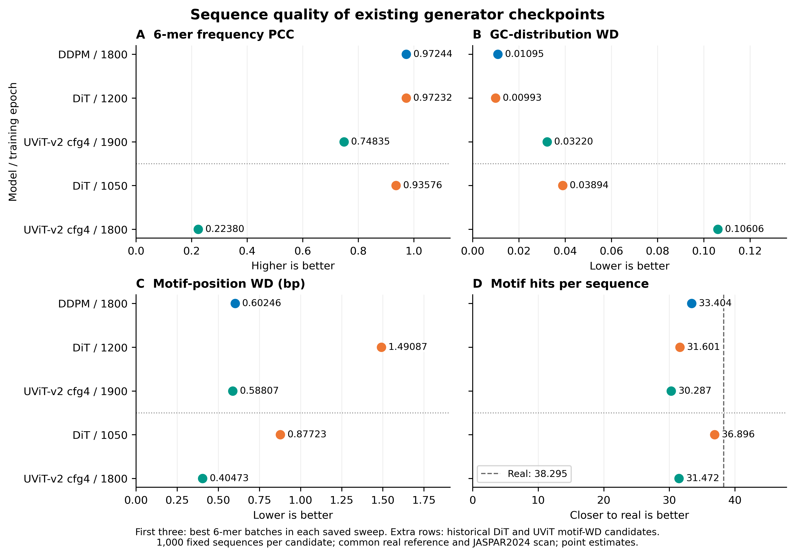

# 同一评价协议下的DDPM、DiT、UViT比较

日期：2026-10-08。用户确认制作统一比较图后，读取40份UViT-v2 config4既有生成FASTA，并与旧版final DDPM/DiT各40份既有FASTA比较；本次没有训练或重新生成序列。对选出的7个候选执行了新的CPU FIMO扫描，全部`--text`输出，不写服务器文件、不使用GPU或提交SLURM。

[Word审阅稿](unified_quality_review_zh.docx)嵌入主图与中文核验结论。

## 数量指标与选型口径修订

motif数量已补入第四面板：每条序列FIMO命中数，参照是38.2948097463次/序列。所有生成候选1000条，直接除以1000；真实参照11984条，以总命中458925除以11984。数量目标是接近真实水平，不是最大化。

| 候选 | 命中总数（1000条） | 次/序列 | 与真实参照绝对差 |
|---|---:|---:|---:|
| DDPM 1800 | 33404 | 33.404 | 4.891 |
| DiT 1200 | 31601 | 31.601 | 6.694 |
| **DiT 1050** | **36896** | **36.896** | **1.399** |
| UViT-v2 config4 1900 | 30287 | 30.287 | 8.008 |
| UViT-v2 config4 1800 | 31472 | 31.472 | 6.823 |

加入数量后，DiT1050最接近真实命中密度（限本次7候选）；它在6-mer/GC/位置WD上弱于DDPM1800，但不能因它不是6-mer最佳而忽略。主图现同时保留DiT1050，以完整展示此权衡。

**选择规则的结论：**按各模型6-mer最大筛候选，适合以组成保真度为关注点的初筛；未预先冻结主指标/门槛，且未对全部120个checkpoint重算同协议的motif数量和位置WD，因此不能视为最终综合选型。事后挑选6-mer最优点，再用其他指标证明某模型最优，会偏向最初指标。当前应称为“候选批次比较”，保留各指标的优势候选，避免自行制定加权总分。

最终研究主线需要先确认主指标、最低序列质量门槛及如何处理指标冲突，再对同等范围的批次作联合评价。motif类别数、各motif频率与重复/低复杂度也需要保留检查，数量接近不等于组成或生物学功能正确。

## 主图



[SVG矢量图](../../figures/model_selection/figure_unified_quality_comparison.svg)；[完整7候选图](../../figures/model_selection/figure_unified_quality_all_candidates.png)。主图先展示各40-checkpoint扫描中的6-mer最佳批次，再保留历史DiT1050以及原先UViT-v2 config4的WD候选1800。没有只选较弱的历史DiT1050作为对照。

| 候选 | 6-mer PCC ↑ | GC分布WD ↓ | 新JASPAR2024位置WD（bp）↓ |
|---|---:|---:|---:|
| DDPM 1800 | 0.972436 | 0.010946 | 0.602462 |
| DiT 1200 | 0.972317 | **0.009931** | 1.490873 |
| UViT-v2 config4 1900 | 0.748349 | 0.032204 | 0.588065 |
| UViT-v2 config4 1800 | 0.223796 | 0.106062 | **0.404726** |

数据来自同一固定生成样本：每个候选1000条、长度160。真实参照为11984条合法唯一NG序列。原始UViT文件9000条，以Python Random(42)无放回固定抽取1000条，并用这1000条计算全部指标。样本成员、顺序和源文件哈希均归档。

## 能支持怎样的选择理由

- **DDPM对DiT：**DDPM1800与DiT1200的6-mer相关性接近，差值仅0.000119，不宣称有显著性或实际重要的优势。DiT的GC距离略低；DDPM的位置WD更低（0.6025 vs 1.4909）。选择DDPM的依据可以是保留接近的局部序列组成，同时减少motif位置分布偏差。
- **DDPM对本轮UViT候选：**DDPM的6-mer与GC指标更接近当前真实参照；UViT1900及1800的位置WD更低。低位置WD并不保证局部序列组成相似，特别是UViT1800在其余两项指标上偏差明显。因此可以说明研究优先兼顾序列组成和motif位置，选DDPM作为后续基础；不能表述为DDPM所有指标最佳。
- **具体权重：**旧版final DDPM1800是该轮DDPM/DiT现存80批次中6-mer最高的候选，其当前权重SHA已登记。本文统一motif评价的新结果不等于完整扫描了120个checkpoint的FIMO，因此不能称1800为全部checkpoint的新WD最小值。

可使用的论文结果表述：

> 在统一序列长度、生成样本数量、真实参照及motif扫描协议后，DDPM epoch1800与DiT epoch1200表现出接近的6-mer频率相关性（0.9724与0.9723），但DDPM的motif位置分布Wasserstein距离更低（0.6025与1.4909）。与本轮UViT-v2 config4候选相比，DDPM在6-mer组成及GC分布上更接近真实参照，而UViT具有更低的位置分布距离。综合上述权衡，DDPM可作为兼顾序列组成与调控模式位置保真度的后续研究基础模型。

以上三项指标措辞不包含数量优势；加入数量后必须同时报告DiT1050更接近真实命中密度的结果，不能仅用三项指标得出综合最优结论。最终主指标和权重尚未在本次自动冻结。10/1引导实验仍是DDPM2000，不能改标为1800。

## 新评价口径

1. 6-mer：正向链重叠窗口，完整4096词表，集合频率向量Pearson相关；参照固定为完整合法NG序列集。
2. GC：逐序列G/C比例的经验分布，用1D Wasserstein距离衡量差异；单位是GC比例，不是碱基位置或百分比单位。
3. motif：FIMO5.4.1，JASPAR2024 CORE plants非冗余数据库，p值阈值1e-4、NRDB背景、motif矩阵伪计数0.1、双链扫描。命中中心取`floor((start+stop)/2)`，以0–159位置的原始命中计数为权重计算1D WD；**不添加位置伪计数**。
4. 新扫描实际读取既有FASTA；UViT扫描全部9000条后只累计固定1000条成员的命中。NRDB背景、阈值和每条序列的评分不依赖其他输入序列，因此过滤到固定成员的结果与单独扫描这些成员一致。
5. 真实参照FASTA的规范化唯一序列集合哈希与用于GC/6-mer的NG CSV序列集合完全一致。真实扫描458925个命中、703个alt-ID类别；每个候选的命中总数、位置计数总和及motif计数总和相等。

旧图WD来自不同JASPAR版本、参照集合和位置伪计数规则，新图只使用本次重新计算的同协议WD；不得将0.6025等新值与旧表0.1404/0.6666等直接混排。

## 限制

这是现存样本的回顾性比较，未重训、未按相同计算预算重新生成；训练数据划分、采样算法及步数不同的影响未隔离。UViT评价范围为v2 config4，未覆盖所有配置或v3。各候选只有一份固定采样，点估计不是多种子重复结果，不能证明统计显著性或生物活性。NG参照是训练来源，非独立测试集。

主图不是加权总分或“DDPM获胜”排名。各模型6-mer最佳候选来自对同一参照的扫描选择，属于回顾性选型；确定投稿主指标和最低质量门槛后，应另行用独立参照/重复采样验证选择。

## 数据、哈希与代码

- [统一指标表](../../data/verified/unified_quality_comparison.csv)
- [固定1000条成员、源记录ID及序列哈希](../../data/verified/unified_quality_membership.csv)
- [新FIMO环境、命中与位置计数](../../data/verified/unified_fimo_scan_results.json)
- [统一协议](../../data/verified/unified_quality_protocol.json)
- [UViT config4的40批次6-mer扫描](../../data/verified/unified_uvit4_sixmer_sweep.csv)、[40份FASTA来源哈希](../../data/verified/unified_uvit4_source_manifest.csv)
- [准备与抽样脚本](../../scripts/prepare_unified_quality_benchmark.py)、[CPU只读FIMO核心](../../scripts/scan_unified_motifs_readonly.py)、[指标合并脚本](../../scripts/finish_unified_quality_benchmark.py)、[绘图脚本](../../figures/plot_unified_quality_comparison.py)

私有输入是只读JSON导出（同既有输入格式）：sources_03.json、sources_legacy_all_fasta.json、sources_uvit4_sweep_fasta.json。FIMO输出为unified_fimo_readonly.jsonl，逐行环境或候选统计；服务器脚本通过标准输出导出，本地保存。没有上传DNA原文、私钥、服务器身份或整个PPT。

```bash
python scripts/prepare_unified_quality_benchmark.py --source-dir /path/to/private/exports
python scripts/finish_unified_quality_benchmark.py --source-dir /path/to/private/exports
python figures/plot_unified_quality_comparison.py
python figures/plot_unified_quality_comparison.py --all-candidates
```

需要重新执行远程扫描时，遵守当前授权和服务器操作边界；本模块本身没有SSH或服务器写入功能。
